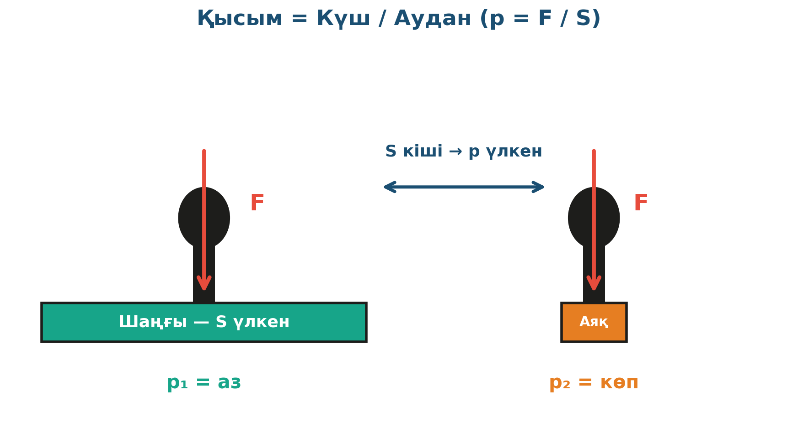

# 1. «Шаңғы немесе коньки?»

## Жоба паспорты

| | |
|---|---|
| **Сыныбы** | 7-сынып |
| **Бөлім** | Қысым. Қатты дененің қысымы |
| **Уақыты** | 1 сабақ |
| **Жоба түрі** | Зерттеушілік |

## Мақсаты

Қысымның күшке тура және тірек ауданына кері пропорционал екенін эксперимент пен PhET симуляциясы арқылы дәлелдеу.

## Зерттеу гипотезасы

> Қысым күшке тура пропорционал, тірек ауданына кері пропорционал: p = F/S.

## Зерттеу сұрақтары

1. Тірек ауданын 2 есе ұлғайтсақ, қысым қалай өзгереді?
2. Бірдей салмақ әртүрлі бетке қандай із қалдырады?
3. Шаңғы ені шынында батудан құтқарады ма?

## Қалыптасатын зерттеу дағдылары

- Формуланы тәжірибемен байланыстыру
- Сандық деректерді өңдеу
- Графикалық тәуелділіктер құру
- Цифрлық симуляторды қолдану
- Қорытынды шығару

## Қажетті жабдықтар

- Кірпіш немесе ауыр кітап
- Ұн салынған науа
- Сызғыш
- PhET «Pressure» симуляциясы
- Кесте бланкісі

## Алдын ала қажет білім

- Күш және салмақ (7-сынып)
- Күштің өлшем бірлігі — Ньютон
- Аудан есептеу (5-сынып математика)

## Жобаның кезеңдері

1. Мотивация. «Шаңғы киген адам неге қарға батпайды?»
2. Жоспарлау. Гипотеза құру: p = F/S. Эксперимент жоспары.
3. Эксперимент. Кірпішті әр түрлі қырымен ұнға қою → із тереңдігін өлшеу. PhET модельімен салыстыру.
4. Талдау. p мәндерін кестеге салу, графикалық тәуелділік.
5. Презентация. Әр топ нәтижесін айтады.

## Күтілетін нәтиже

Оқушы p = F/S заңдылығын тәжірибеде дәлелдейді, тұрмыстық мысалдарды (өкше, кесек, шаңғы) физикалық тілге аудара алады.

## Бағалау критерийлері

Жоспар (5), эксперимент дәлдігі (5), есептеу (5), қорытынды (5).

## Пәнаралық байланыс

Биология (биологиялық жабдықтар — тісбас, тырнақ), технология (құрылыс — фундамент кеңейту).

## Рефлексия сұрақтары (сабақ соңында)

1. Кір тастарды неліктен үш бұрышты етіп жасайды?
2. Цирктегі акробат жарма тақтайда неге тұра алады?

## Үй тапсырмасы / жобаның жалғасы

Өкшелі және тегіс табанды аяқ киімдердің қарға қалдырған іздерін фотосуретке алып, тірек аудандарын есептеп, сол адам үшін қысымды салыстыру.

## Мұғалімге практикалық кеңес

> 💡 Алдымен «Күш және Күшке тірелетін аудан» дегенді нақты бөліп ажырату қажет — оқушылар бұл екеуін шатастырады. Кірпіш мысалы әсіресе нәтижелі.

## Цифрлық қолдау

PhET «Pressure» симуляторында p = F/S тәуелділігін графикалық бақылау.

## ⚠️ Қауіпсіздік ережелері

Ауыр зат жұмысында саусақ-аяқтан абайлау.

---

