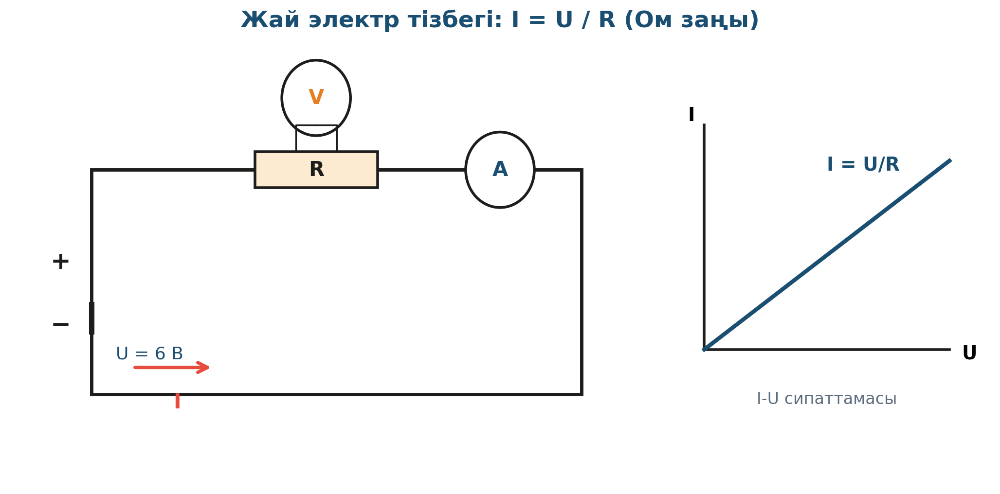

# 2. «Электр энергиясы әлеміне саяхат»

## Жоба паспорты

| | |
|---|---|
| **Сыныбы** | 8-сынып |
| **Бөлім** | Электр құбылыстары |
| **Уақыты** | 2 сабақ (90 мин) |
| **Жоба түрі** | Зерттеушілік |

## Мақсаты

Жай электр тізбегінің жұмысын зерттеу: Ом заңын тексеру, кернеу мен ток күші арасындағы байланысты табу.

## Зерттеу гипотезасы

> Тізбектегі ток күші кернеуге тура, кедергіге кері пропорционал: I = U/R (Ом заңы).

## Зерттеу сұрақтары

1. U-ны 2 есе арттырғанда I қалай өзгереді?
2. R-ды өзгертсек ток күші қалай реакция береді?
3. Тізбек элементтерінің тізбектей қосылуы Ом заңына қалай әсер етеді?

## Қалыптасатын зерттеу дағдылары

- Электр тізбегін жинау
- Амперметр мен вольтметрді дұрыс қосу
- I–U графигін құру
- Ом заңын дәлелдеу
- Қателіктерді талдау

## Қажетті жабдықтар

- Тізбек жинағы (батарея, өткізгіштер, кедергі)
- Амперметр
- Вольтметр
- PhET «Circuit Construction Kit»
- Реостат

## Алдын ала қажет білім

- Электр заряды және ток ұғымы
- Кернеу мен ток арасындағы айырмашылық
- Қарапайым электр сұлбаларын оқу

## Жобаның кезеңдері

1. Мотивация. PhET-те виртуалды тізбек жинау, шамдардың әр түрлі жарықтығын көрсету.
2. Жоспарлау. R = const ұстап, U-ны өзгертіп I-ны өлшейтін эксперимент.
3. Эксперимент. 5–6 нүкте бойынша I-U деректерін жинау.
4. Талдау. Графикке салғанда I = U/R сызықтығы көрінеді.
5. Презентация. Кедергісі әр түрлі тізбектердің салыстырмалы талдауы.

## Күтілетін нәтиже

Оқушы Ом заңын тәжірибеде дәлелдеп, амперметр/вольтметрді дұрыс қосу дағдысын меңгереді.

## Бағалау критерийлері

Тізбек жинау (5), өлшеу (5), график (5), қорытынды (5).

## Пәнаралық байланыс

Информатика (микросхема архитектурасы), экономика (электр энергиясы тарифтері).

## Рефлексия сұрақтары (сабақ соңында)

1. Жыртылған сым — қауіпсіздік үшін неге қауіпті?
2. Үйдегі шамдар тізбектей қосылса не болар еді?

## Үй тапсырмасы / жобаның жалғасы

PhET-те 3 түрлі кедергіні бір батареяға қосып, токтың қалай өзгеретінін кесте мен графикке енгізу.

## Мұғалімге практикалық кеңес

> 💡 Амперметрді әрқашан тізбектей, вольтметрді параллель қосу — оқушылардың жиі жасайтын қателігі. Сұлбаға қызыл/көк сым бояуын қою — қателіктерді азайтады.

## Цифрлық қолдау

PhET «Circuit Construction Kit (DC)» — виртуалды макет арқылы тізбекті жинау.

## ⚠️ Қауіпсіздік ережелері

Кернеу 12 В-тан аспауы керек. Қысқа тұйықталуды болдырмау.

---

