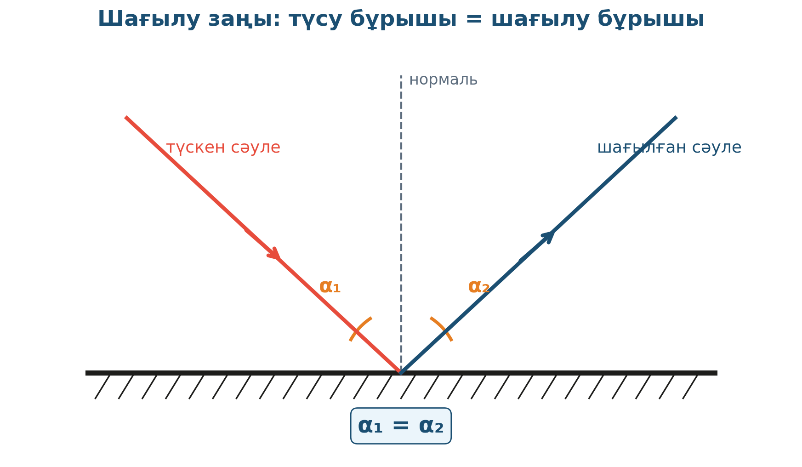

# 3. «Қарайтын әйнек әлемінде»

## Жоба паспорты

| | |
|---|---|
| **Сыныбы** | 8-сынып |
| **Бөлім** | Жарық. Шағылу |
| **Уақыты** | 1 сабақ |
| **Жоба түрі** | Тәжірибелік |

## Мақсаты

Жазық айнадан жарықтың шағылу заңын тексеру: түсу бұрышы шағылу бұрышына тең.

## Зерттеу гипотезасы

> Шағылу заңы әмбебап: түсу бұрышы шағылу бұрышына тең (α₁ = α₂).

## Зерттеу сұрақтары

1. Әртүрлі бұрыштарда заң дұрыс орындала ма?
2. Айна қаншалықты тегіс болуы керек?
3. Перископ қалай жұмыс істейді?

## Қалыптасатын зерттеу дағдылары

- Бұрыштарды өлшеу
- Заңды эксперимент жолымен дәлелдеу
- Транспортирмен жұмыс
- Геометриялық сұлба

## Қажетті жабдықтар

- Жазық айна
- Лазер көрсеткіш
- Транспортир
- Ақ парақ
- Сызғыш

## Алдын ала қажет білім

- Жарық сәулесі ұғымы
- Бұрыштарды транспортирмен өлшеу
- Геометриялық сұлба құру

## Жобаның кезеңдері

1. Мотивация. Айнаға қарап оқушылар өз бейнесін көрсетеді.
2. Жоспарлау. Лазерді әртүрлі бұрышпен айнаға бағыттау сұлбасы.
3. Эксперимент. 30°, 45°, 60° түсу бұрыштарына сай шағылу бұрыштарын өлшеу.
4. Талдау. Кесте: түсу = шағылу.
5. Презентация. Сұлба арқылы заңдылықты дәлелдеу.

## Күтілетін нәтиже

Оқушы шағылу заңын тәжірибеде көрсетеді, перископ принципін түсінеді.

## Бағалау критерийлері

Бұрыш дәлдігі (5), сұлба (5), қорытынды (5), презентация (5).

## Пәнаралық байланыс

Геометрия (бұрыштар, перпендикулярлық), технология (перископ, зеркалді жұмыс істейтін аспаптар).

## Рефлексия сұрақтары (сабақ соңында)

1. Айна тегіс емес болса не болады?
2. Тұрмыстағы перископтар қайда қолданылады?

## Үй тапсырмасы / жобаның жалғасы

Үйде картон қорабтан перископ жасап, столдың арт жағындағы заттарды көрсету. Сұлба дәптерге салынады.

## Мұғалімге практикалық кеңес

> 💡 Бұрыштарды дәл өлшеу үшін лазерден алыс ақ парақ — 1 м-ден жақын болмауы тиіс. Айнадан 50 см ара қашықтық — оңтайлы.

## Цифрлық қолдау

PhET «Bending Light» — шағылуды виртуалды модельдеу.

## ⚠️ Қауіпсіздік ережелері

Лазерді көзге бағыттамау. Айнаны абайлап ұстау.

---

