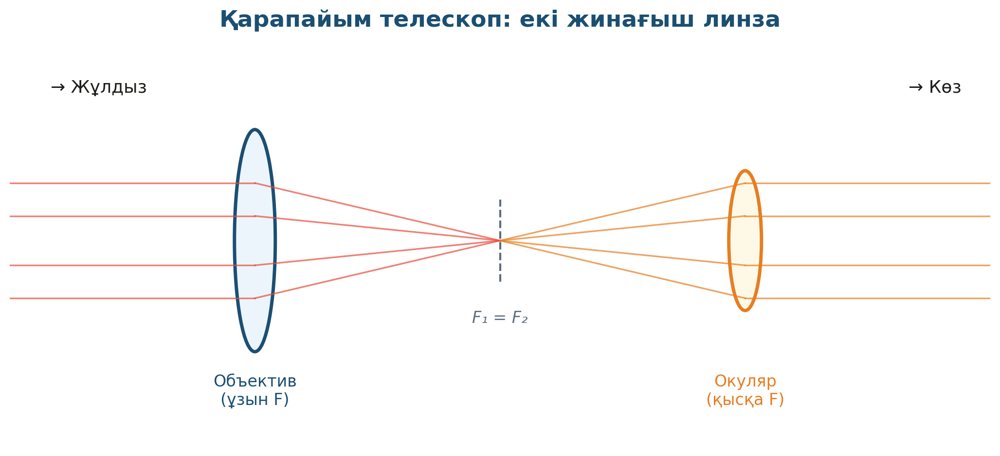

# 4. «Оптикалық аспаптар»

## Жоба паспорты

| | |
|---|---|
| **Сыныбы** | 8-сынып |
| **Бөлім** | Линзалар |
| **Уақыты** | 1 сабақ |
| **Жоба түрі** | Шығармашылық |

## Мақсаты

Жинағыш және шашыратқыш линзалар арқылы қарапайым перископ, кубиндік камера немесе телескоп моделін жасау.

## Зерттеу гипотезасы

> Жинағыш линзалардың комбинациясы әртүрлі оптикалық аспап бере алады (телескоп, лупа, перископ).

## Зерттеу сұрақтары

1. Объективтің фокус арақашықтығы зор болса бейне қалай өзгереді?
2. Кібісе қандай линза алу керек?
3. Үйдегі көзілдірік қандай типке жатады?

## Қалыптасатын зерттеу дағдылары

- Линзалардың қасиеттерін қолдану
- Инженерлік шешім жасау
- Геометриялық оптика заңдарын қолдану
- Шығармашылық ойлау

## Қажетті жабдықтар

- 2 жинағыш линза (фокустары әр түрлі)
- Картон түтік
- Желімдеуіш
- Сызғыш
- Қайшы

## Алдын ала қажет білім

- Линзаның бас фокусы
- Жинағыш және шашыратқыш линзалардың қасиеттері
- Жарық сәулесінің сынуы

## Жобаның кезеңдері

1. Мотивация. Мұғалім қарапайым телескоп көрсетеді.
2. Жоспарлау. Топтар: А — телескоп, Б — перископ, В — лупа.
3. Эксперимент. Қондырғыны жасап, көріністі тексеру.
4. Талдау. Әр құрылғының жұмыс принципі сұлба арқылы.
5. Презентация. Жасалған құрылғыны көрсету.

## Күтілетін нәтиже

Оқушы линзалардың әртүрлі комбинациясынан қандай оптикалық құрылғы жасауға болатынын біледі.

## Бағалау критерийлері

Қондырғы (10), теория (5), презентация (5).

## Пәнаралық байланыс

Биология (көздің құрылысы — табиғи линза), астрономия (телескоптар тарихы).

## Рефлексия сұрақтары (сабақ соңында)

1. Күн сәулесін линзамен бір нүктеге шоғырландырғанда не болады?
2. Алыс жұлдыздарды неге біз тек телескоп арқылы көреміз?

## Үй тапсырмасы / жобаның жалғасы

Үй жағдайында картон түтік пен 2 линзадан қарапайым телескоп жасап, аймен жұлдызды бақылау.

## Мұғалімге практикалық кеңес

> 💡 Күн сәулесін линзамен шоғырландыру тәжірибесі қызықты болғанмен, өрт қаупі бар. Тек тұрақты бақылауда жасалады.

## ⚠️ Қауіпсіздік ережелері

Қайшымен жұмыс істегенде сақтық.

---

