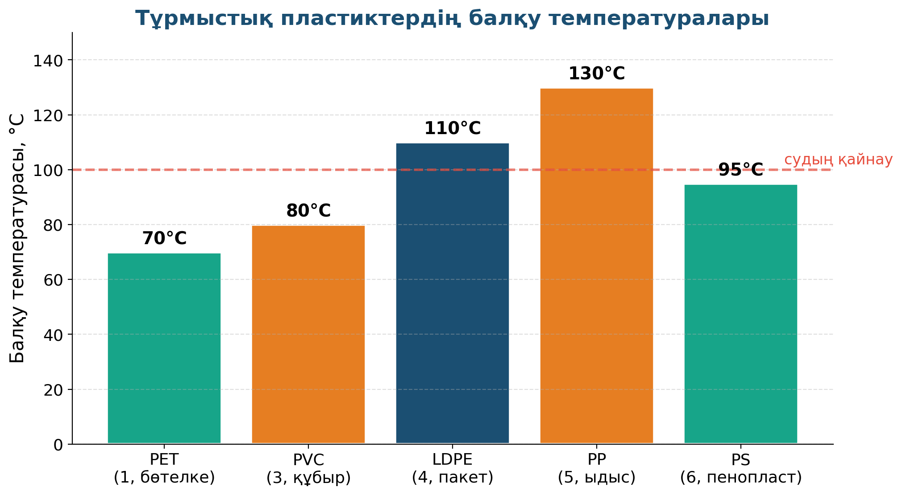

# 5. «Пластикалық құбырды қалай ерітуге болады?»

## Жоба паспорты

| | |
|---|---|
| **Сыныбы** | 8-сынып |
| **Бөлім** | Жылу. Балқу |
| **Уақыты** | 1 сабақ |
| **Жоба түрі** | Зерттеушілік |

## Мақсаты

Әртүрлі пластиктердің балқу температурасын анықтау (PET, PE, PVC түрлерін салыстыру).

## Зерттеу гипотезасы

> Әртүрлі пластиктердің балқу температурасы химиялық құрамына байланысты әртүрлі (PET ~70 °C, PVC ~80 °C, PP ~130 °C).

## Зерттеу сұрақтары

1. Қандай пластик ыстық суға төтеп бере алады?
2. Бір реттік ыдысты микротолқынды пешке салуға бола ма?
3. Шай тостағаны қандай пластиктен жасалуы тиіс?

## Қалыптасатын зерттеу дағдылары

- Жылу беру және тарату
- Температураны өлшеу
- Деректерді кестеге енгізу
- Зат түрлерін ажырата білу

## Қажетті жабдықтар

- 3 түрлі пластикалық бөлшек (PET, PE, PVC)
- Термопар немесе цифрлық термометр
- Электр плитасы немесе ыстық су
- Кесте бланкісі

## Алдын ала қажет білім

- Заттың агрегаттық күй ауысуы
- Балқу температурасы ұғымы
- Полимерлер туралы алғашқы түсінік

## Жобаның кезеңдері

1. Мотивация. Мұғалім: «Қандай пластик ыстық суға төтеп бере алады?»
2. Жоспарлау. Эксперимент жоспары: 50, 70, 90 °C.
3. Эксперимент. Әр пластикті ыстық суда ұстап, өзгерістерді бақылау.
4. Талдау. PET (~70 °C), PE (~110 °C), PVC (~80 °C). Деректер кестеге.
5. Презентация. Тұрмыстағы пластик ыдыстарды дұрыс пайдалану туралы кеңес.

## Күтілетін нәтиже

Оқушы тұрмыстық пластиктердің термиялық қасиеттерін біледі, бір реттік ыдыстарды пайдалану ережелерін түсінеді.

## Бағалау критерийлері

Эксперимент (5), кесте (5), қорытынды (5), пайдалылық (5).

## Пәнаралық байланыс

Химия (полимер құрылымы), экология (пластикалық қалдықтар), биология (микропластиктің ағзаға әсері).

## Рефлексия сұрақтары (сабақ соңында)

1. Тұрмыстық пластиктерді қалай дұрыс пайдалану керек?
2. Қандай балама материалдар бар?

## Үй тапсырмасы / жобаның жалғасы

Үйдегі 5 түрлі пластикалық бұйымның түбіндегі белгісін (PET, PE, PP) тауып, ыстық суға төтеп беретіндігін салыстыру.

## Мұғалімге практикалық кеңес

> 💡 Пластикті балқыту ашық плитада емес, ыстық суда жасалады — улы будың пайда болуын болдырмайды.

## ⚠️ Қауіпсіздік ережелері

Ыстық су күйдіруі мүмкін — қолғап және көзілдірік міндетті.

---

