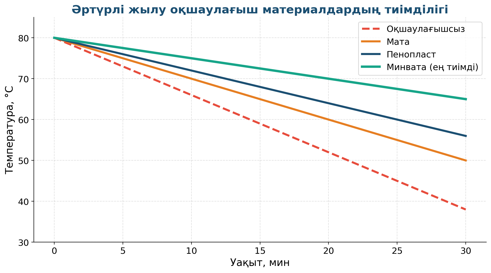

# 6. «Жылуды сақтаймыз»

## Жоба паспорты

| | |
|---|---|
| **Сыныбы** | 10-сынып |
| **Бөлім** | Термодинамика. Жылу алмасу |
| **Уақыты** | Апталық жоба |
| **Жоба түрі** | Зерттеушілік |

## Мақсаты

Әр түрлі жылу оқшаулағыш материалдардың тиімділігін салыстыру (минвата, пенопласт, мата, ауа).

## Зерттеу гипотезасы

> Жылу оқшаулағыш материалдар жылу алмасу жылдамдығын азайтады; минвата мен пенопласт ең тиімді.

## Зерттеу сұрақтары

1. 30 минутта температура қанша градусқа төмендейді?
2. Қай материал ең тиімді?
3. Үйді жылыту үшін қанша қаражат үнемделеді?

## Қалыптасатын зерттеу дағдылары

- Калориметрлік өлшеу
- Q = c·m·ΔT формуласын қолдану
- Графиктер арқылы салыстыру
- Энергия үнемдеу принциптері

## Қажетті жабдықтар

- 3–4 түрлі оқшаулағыш материал
- Калориметр (немесе термос)
- Цифрлық термометр
- Ыстық су
- Секундомер

## Алдын ала қажет білім

- Жылу алмасу 3 түрі (өткізгіштік, конвекция, сәулелену)
- Q = c·m·ΔT формуласы
- Меншікті жылу сыйымдылық

## Жобаның кезеңдері

1. Мотивация. «Үйлерді неге кейінгі кездері пенопластпен орайды?»
2. Жоспарлау. Бір көлемде ыстық су әр оқшаулауда — температураны 30 минут өлшеу.
3. Эксперимент. Әр 5 минут сайын T-ны жазу.
4. Талдау. Графикке салу: ең баяу салқындаған = ең тиімді.
5. Презентация. Үйді жылыту стратегиясы.

## Күтілетін нәтиже

Оқушы жылу оқшаулағыштардың энергия үнемдеудегі рөлін түсінеді, нақты материалдарды салыстыра алады.

## Бағалау критерийлері

Эксперимент (5), өлшеу (5), график (5), пайдалы ұсыныс (5).

## Пәнаралық байланыс

Экономика (энергия үнемдеу), құрылыс (қазіргі үй жылу оқшаулау технологиялары).

## Рефлексия сұрақтары (сабақ соңында)

1. Үйде қандай оқшаулағыштар бар? Олар тиімді ме?
2. Терезеден жылу қалай жоғалады?

## Үй тапсырмасы / жобаның жалғасы

Үйде термос пен қарапайым шыны кружкаға бір көлемде ыстық су құйып, 30 минут өткен соң температураны өлшеп — айырмашылықты жазу.

## Мұғалімге практикалық кеңес

> 💡 Эксперимент 30 минут болғандықтан, оны 2 сабаққа бөліп жоспарлаған абзал. Бірінші 5 мин — баптау, кейінгі сабақта — өлшеулер мен талдау.

## Цифрлық қолдау

PhET «Energy Forms and Changes» — жылу алмасу процесін визуалды модельдеу.

## ⚠️ Қауіпсіздік ережелері

Ыстық суды абайлап пайдалану.

---

