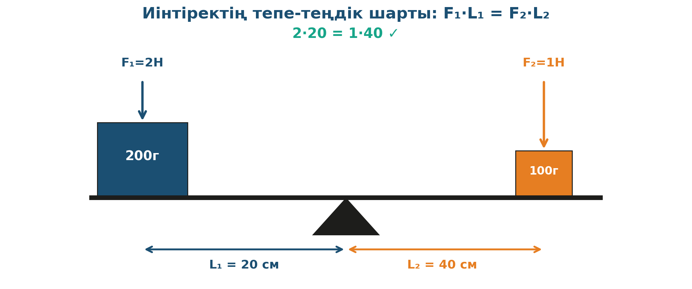

# 7. «Тепе-теңдікте»

## Жоба паспорты

| | |
|---|---|
| **Сыныбы** | 9-сынып |
| **Бөлім** | Механика. Қатты дененің тепе-теңдігі |
| **Уақыты** | 1 сабақ |
| **Жоба түрі** | Зерттеушілік |

## Мақсаты

Иінтіректің тепе-теңдік шартын тәжірибе арқылы тексеру: F₁·L₁ = F₂·L₂.

## Зерттеу гипотезасы

> Иінтіректің тепе-теңдігі шарты F₁·L₁ = F₂·L₂ — әмбебап.

## Зерттеу сұрақтары

1. F және L көбейтіндісі неге сақталады?
2. Иық қаншалықты ұзын болуы керек?
3. Тепе-теңдік шарты тұрмыста қайда қолданылады?

## Қалыптасатын зерттеу дағдылары

- Күштер моментімен есептеу
- Тепе-теңдік шартын тексеру
- Дәл өлшеу
- Графикалық дәлелдеу

## Қажетті жабдықтар

- Иінтірек (сызғыш + штатив)
- Жүктер жинағы (50, 100, 200 г)
- Сызғыш
- Динамометр

## Алдын ала қажет білім

- Күш моменті ұғымы (M = F·L)
- Тіреу нүктесі
- Динамометр көрсеткіштерін оқу

## Жобаның кезеңдері

1. Мотивация. Мұғалім қарапайым таразы көрсетеді.
2. Жоспарлау. Иінтіректі тепе-теңдікке келтіру.
3. Эксперимент. 5–6 түрлі салмақ-иық комбинациясын тексеру.
4. Талдау. F·L көбейтінділері тепе-теңдікте тең екенін көрсету.
5. Презентация. Жұмыс істейтін таразылардың жұмыс принципі.

## Күтілетін нәтиже

Оқушы момент ұғымын меңгереді, иінтіректің тепе-теңдік шартын дәлелдеп көрсете алады.

## Бағалау критерийлері

Дәл өлшеу (5), есептеу (5), қорытынды (5), презентация (5).

## Пәнаралық байланыс

Биология (адам сүйектерінің иінтірек ретінде жұмыс істеуі), технология (таразы, темірші балғасы).

## Рефлексия сұрақтары (сабақ соңында)

1. Қалай таразы дұрыс өлшейтінін біле аламыз?
2. Доғал темір болатты ұрғанда неге саптың ұзындығы маңызды?

## Үй тапсырмасы / жобаның жалғасы

Үйде үстелге сызғыш қойып, тиынмен иінтірек жасап, тепе-теңдікті 5 түрлі позицияда тексеру.

## Мұғалімге практикалық кеңес

> 💡 Сызғышты штативке тиісінше орталықтап орнату — өзіндік моменттерден құтылу үшін. Әйтпесе деректер шамалы бұрмаланады.

## ⚠️ Қауіпсіздік ережелері

Жүктердің құлап кетуінен сақтану.

---

