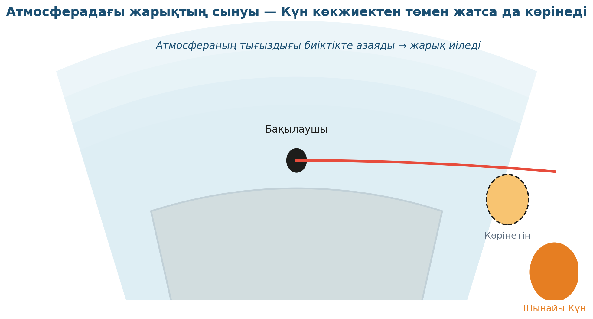

# 8. «Көкжиекке көзқарас»

## Жоба паспорты

| | |
|---|---|
| **Сыныбы** | 11-сынып |
| **Бөлім** | Геометриялық оптика |
| **Уақыты** | 1 сабақ |
| **Жоба түрі** | Зерттеушілік |

## Мақсаты

Атмосферадағы жарықтың сынуы себебінен Күн көкжиектен төмен тұрғанда да көрінуін модельдеу.

## Зерттеу гипотезасы

> Жарық тығыздығы әртүрлі ортада сынады; атмосфераның тығыздығы биіктікте азаятындықтан, сәуле иіледі.

## Зерттеу сұрақтары

1. Тұз концентрациясы артқанда сыну бұрышы қалай өзгереді?
2. Снелл заңы дәл орындала ма?
3. Күннің батуы шынында бір минут бұрын болады деген қалай дәлелденеді?

## Қалыптасатын зерттеу дағдылары

- Жарықтың сыну заңын қолдану
- Атмосфералық оптиканы түсіну
- Модельдік ойлау
- Жарық жолын сұлбамен сипаттау

## Қажетті жабдықтар

- Стақан су
- Лазер көрсеткіш
- Транспортир
- Парта тегістігі
- Тұз қосылған су (тығыздықты өзгерту үшін)

## Алдын ала қажет білім

- Жарықтың сыну заңы (Снелл)
- Орта сыну көрсеткіші
- Тығыздық ұғымы

## Жобаның кезеңдері

1. Мотивация. «Күннің батуы шынында бір минут бұрын болады. Неге?»
2. Жоспарлау. Жарықты әр түрлі тығыздықтағы суға бағыттау сұлбасы.
3. Эксперимент. Тұз әртүрлі мөлшерде судың тығыздығын өзгертіп, сыну бұрыштарын өлшеу.
4. Талдау. Тығыздық үлкен болған сайын n үлкен. Снелл заңы.
5. Презентация. Атмосферадағы жарықтың иілуі.

## Күтілетін нәтиже

Оқушы атмосфералық рефракцияны түсінеді, теориялық n-ді тәжірибеден шығара алады.

## Бағалау критерийлері

Эксперимент (5), есептеу (5), теория (5), презентация (5).

## Пәнаралық байланыс

Астрономия (атмосфералық рефракция), география (Күн көтерілуі/батуы).

## Рефлексия сұрақтары (сабақ соңында)

1. Шөл далада «миражды» ары-бері көретіндер қалай түсіндіреді?
2. Жарық қандай орталарда көп иіледі?

## Үй тапсырмасы / жобаның жалғасы

Үйде бір стақан су ішіне қарындашты түсіріп, сурет түсіру; қарындаштың «сынғанын» геометриялық сұлбамен түсіндіру.

## Мұғалімге практикалық кеңес

> 💡 Лазер сәулесін көрсету үшін экранға аздап тұман немесе бөлме шаңы көмектеседі — сәуле жолын анық көреміз.

## ⚠️ Қауіпсіздік ережелері

Лазерді көзге бағыттамау.

---

