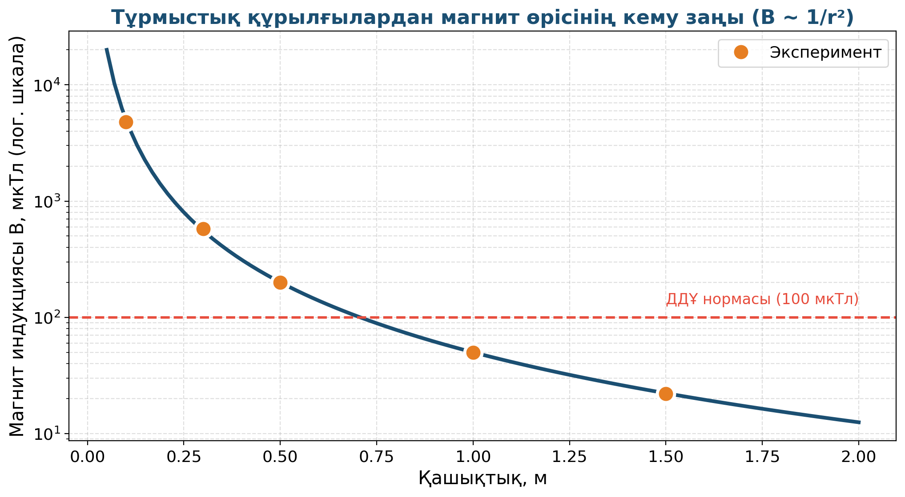

# 9. «Электромагниттік индукцияның адамға әсері»

## Жоба паспорты

| | |
|---|---|
| **Сыныбы** | 11-сынып |
| **Бөлім** | Электромагнетизм |
| **Уақыты** | Айлық жоба |
| **Жоба түрі** | Зерттеушілік |

## Мақсаты

Күнделікті өмірдегі электромагниттік сәулеленудің көздерін зерттеп, олардың денсаулыққа әсерін талдау.

## Зерттеу гипотезасы

> Тұрмыстық құрылғылардан таралатын магнит өрісі қашықтыққа кері пропорционал (B ~ 1/r²); 30 см алыс — қауіпсіз шама.

## Зерттеу сұрақтары

1. Wi-Fi роутерден 1 м қашықтықта өріс қандай?
2. Микротолқынды пеш жұмыс істегенде қандай шамада?
3. ДДҰ нормалары бойынша қауіпсіз қашықтық қанша?

## Қалыптасатын зерттеу дағдылары

- Магнит өрісін өлшеу (Phyphox)
- Әдеби көздерді талдау
- Деректерді статистикалық өңдеу
- Презентация дайындау
- Сыни ойлау

## Қажетті жабдықтар

- Phyphox қосымшасы (магнитометр)
- Әртүрлі тұрмыстық құрылғылар
- Сызғыш
- Кесте

## Алдын ала қажет білім

- Магниттік индукция ұғымы
- Электромагниттік толқын
- Phyphox-ты пайдалану дағдысы

## Жобаның кезеңдері

1. Мотивация. «Wi-Fi роутер денсаулыққа қауіпті ме?»
2. Жоспарлау. 5–7 тұрмыстық құрылғыдан қашықтыққа байланысты магнит өрісін өлшеу.
3. Эксперимент (3 апта). Деректер жинау, графиктер, қашықтыққа тәуелділік.
4. Талдау. Қашықтық 2 есе ↑ → өріс 4 есе ↓ (1/r²).
5. Презентация. ДДҰ (WHO) деректерімен салыстыру.

## Күтілетін нәтиже

Оқушы шынайы өріс өлшемдерін деректерден алып, ұялы байланыс және Wi-Fi өрістерінің гигиеналық нормаларын біледі.

## Бағалау критерийлері

Деректер (5), әдеби талдау (5), презентация (5), қорытынды (5).

## Пәнаралық байланыс

Биология (электромагниттік сәулеленудің денсаулыққа әсері), статистика (деректерді өңдеу).

## Рефлексия сұрақтары (сабақ соңында)

1. Ұялы телефон жастық астында ұйықтау қаупі бар ма?
2. Әдеби көздерде қандай нормалар көрсетілген?

## Үй тапсырмасы / жобаның жалғасы

Үйде 5 түрлі құрылғыдан 10, 30, 50, 100 см арақашықтықта Phyphox-пен өрісті өлшеу. Деректерді кестеге енгізіп, графикалық тәуелділік құру.

## Мұғалімге практикалық кеңес

> 💡 Әртүрлі смартфондарда сенсорлардың сезімталдығы әр түрлі — салыстыру үшін бір ғана аспап қолданған тиімді.

## Цифрлық қолдау

Phyphox қосымшасының «Magnetometer» режимі — тегін қол жетімді.

## ⚠️ Қауіпсіздік ережелері

Электр құрылғыларынан 30 см-ден жақын келмеу.

---

