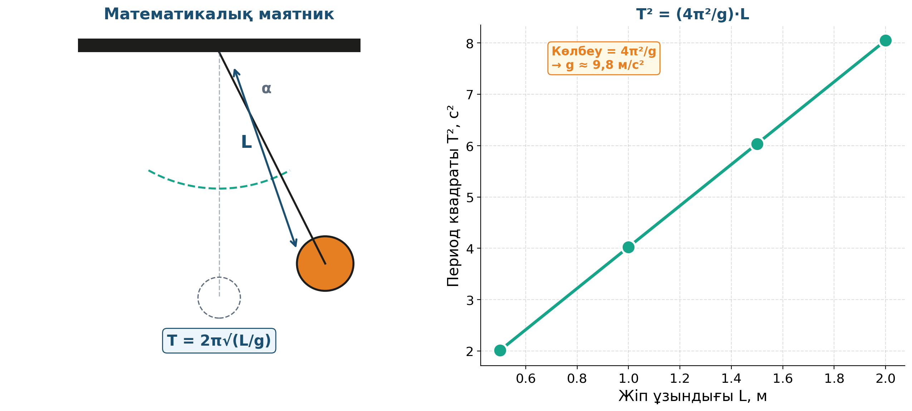

# 10. «Тербелістер әлемінде»

## Жоба паспорты

| | |
|---|---|
| **Сыныбы** | 11-сынып |
| **Бөлім** | Тербелістер мен толқындар |
| **Уақыты** | 2 сабақ |
| **Жоба түрі** | Зерттеушілік |

## Мақсаты

Математикалық маятниктің периодының ұзындыққа тәуелділігін тәжірибе арқылы тексеру және g мәнін есептеу.

## Зерттеу гипотезасы

> Математикалық маятниктің периоды массаға тәуелсіз, тек ұзындыққа байланысты: T = 2π√(L/g).

## Зерттеу сұрақтары

1. L артқанда T қалай өзгереді?
2. Массаны 2 есе арттырғанда период өзгере ме?
3. g мәнін эксперименттен қалай шығарамыз?

## Қалыптасатын зерттеу дағдылары

- Period өлшеу
- Phyphox таймерін қолдану
- T = 2π√(L/g) формуласын тексеру
- Сызықтық регрессия
- Қателіктерді бағалау

## Қажетті жабдықтар

- Жіп (1–2 м)
- Жүктеме
- Phyphox қосымшасы
- Сызғыш
- Секундомер

## Алдын ала қажет білім

- Тербеліс ұғымы
- Период және жиілік
- Гармоникалық қозғалыс

## Жобаның кезеңдері

1. Мотивация. Үлкен маятник демонстрациясы.
2. Жоспарлау. L = 0.5; 1.0; 1.5; 2.0 м үшін периодты өлшеу.
3. Эксперимент. 10 толық тербелістің уақыты → T бөлініп есептеу.
4. Талдау. T² мен L арасындағы сызықтық тәуелділік. g есептеу.
5. Презентация. g ≈ 9,8 ± 0,2 м/с².

## Күтілетін нәтиже

Оқушы T = 2π√(L/g) формуласын тәжірибеде дәлелдейді, g мәнін эксперимент арқылы анықтайды.

## Бағалау критерийлері

Деректер (5), есептеу (5), қателіктер (5), презентация (5).

## Пәнаралық байланыс

Математика (тригонометриялық функциялар, регрессия), технология (механикалық сағаттар).

## Рефлексия сұрақтары (сабақ соңында)

1. g неліктен барлық жерде бірдей емес?
2. Сағаттың маятнигі неге дәл сондай ұзындықта?

## Үй тапсырмасы / жобаның жалғасы

Phyphox «Pendulum» режимінде үйдегі люстраны маятник ретінде пайдаланып, T-ны дәл өлшеп, g-ны есептеу.

## Мұғалімге практикалық кеңес

> 💡 Кіші амплитуда (5°-тан аспайтын) маңызды — әйтпесе T = 2π√(L/g) қарапайым формула жұмыс істемейді. Оқушыларға «маятникті біршама ғана аз бұру» деп нақты түсіндіру қажет.

## Цифрлық қолдау

PhET «Pendulum Lab» — маятник параметрлерін виртуалды өзгертіп зерттеу.

## ⚠️ Қауіпсіздік ережелері

Жүкті мықтап байлау.

---

