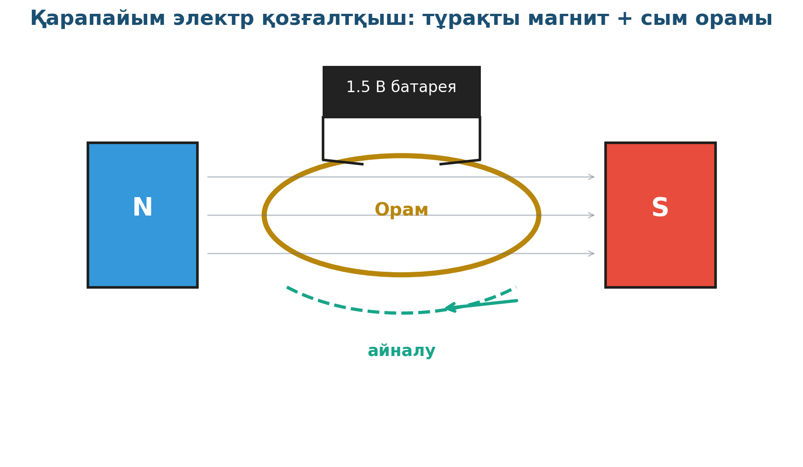

# 11. «Өз қолыңызбен электр қозғалтқышы»

## Жоба паспорты

| | |
|---|---|
| **Сыныбы** | 10-сынып |
| **Бөлім** | Электромагнетизм |
| **Уақыты** | Айлық жоба |
| **Жоба түрі** | Шығармашылық |

## Мақсаты

Қарапайым материалдардан тұрақты ток электр қозғалтқышының моделін құрастыру.

## Зерттеу гипотезасы

> Магнит өрісі мен ток өткізетін орам арасындағы Ампер күші орамды айналдырады.

## Зерттеу сұрақтары

1. Орамды қандай бағытта қозғалтады?
2. Магнит күші қозғалтқыш жылдамдығына қалай әсер етеді?
3. Орам неге үздіксіз бір бағытта айналмайды?

## Қалыптасатын зерттеу дағдылары

- Магнит және электр өзара әрекеті
- Конструкциялық дағдылар
- Тіреу нүктелерін есептеу
- Эксперимент-инженерия

## Қажетті жабдықтар

- Тұрақты магниттер (2)
- Мыс сым (изоляциясыз)
- АА батарея (1.5 В)
- Қағаз қыстырғыштар
- Дөңгелек өзек

## Алдын ала қажет білім

- Магнит өрісі ұғымы
- Ампер күші
- Тұйық тізбек және электр қозғаушы күші

## Жобаның кезеңдері

1. Мотивация. «Электр қозғалтқыш ішінде не бар?»
2. Жоспарлау. Сұлба сызу, материалдар жоспары.
3. Эксперимент. Орамды дайындау → тізбекке қосу → магнит өрісінде айналдыру.
4. Талдау. Айнымалы күштің пайда болу себебі — Ампер заңы.
5. Презентация. Жасалған қозғалтқышты көрсету.

## Күтілетін нәтиже

Оқушы электр қозғалтқыштың жұмыс принципін біледі, өз қолымен қарапайым модель жасайды.

## Бағалау критерийлері

Қозғалтқыштың жұмысы (10), сұлба (5), теория (5).

## Пәнаралық байланыс

Технология (құрылыста, көлікте, тұрмыстық техникада қолдану), тарих (Фарадей мен Максвелл ашулары).

## Рефлексия сұрақтары (сабақ соңында)

1. Тоңазытқыш және жуғыш машинаның қозғалтқышы қалай жұмыс істейді?
2. Қалай айналу бағытын ауыстыруға болады?

## Үй тапсырмасы / жобаның жалғасы

Жасалған қозғалтқышты сыныптас алдында көрсету (3 минуттық видео-демонстрация). Иә, бұл — өз қолыңмен жасаған электр қозғалтқыш!

## Мұғалімге практикалық кеңес

> 💡 Сым қыза бастаса (15–20 секундтан кейін) дереу батареядан ажырату — өрт қаупі бар. Эксперимент циклы 30 секундтан аспауы тиіс.

## ⚠️ Қауіпсіздік ережелері

Қыздыруға дейін қалдырмау. Тізбекті ұзақ қыска қоспау.

---

