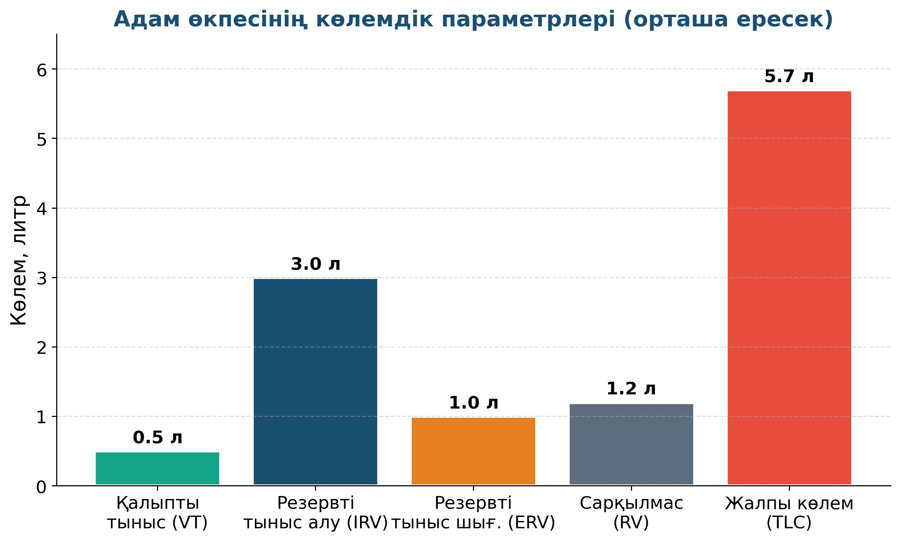

# 12. «Адам тынысы»

## Жоба паспорты

| | |
|---|---|
| **Сыныбы** | 10-сынып |
| **Бөлім** | Молекулалық-кинетикалық теория |
| **Уақыты** | 1 сабақ |
| **Жоба түрі** | Зерттеушілік |

## Мақсаты

Адам шығаратын ауаның құрамы мен температурасын зерттеу, тыныс жиілігі мен өкпе көлемін бағалау.

## Зерттеу гипотезасы

> Адам тыныс шығарғанда шамамен 0,5 л ауа шығарады; өкпенің жалпы көлемі ~5–6 литр.

## Зерттеу сұрақтары

1. Бір тыныста қанша ауа шығады?
2. Спорт жасаған адамның өкпе көлемі қарапайымнан көп пе?
3. 1 минут ішінде адам неше тыныс алады?

## Қалыптасатын зерттеу дағдылары

- Газдар туралы заңдарды қолдану
- Биофизикалық параметрлерді өлшеу
- Деректерді тіркеу
- Биология-физика байланысы

## Қажетті жабдықтар

- Воздушный шар
- Сантиметрлік таспа
- Цифрлық термометр
- Секундомер

## Алдын ала қажет білім

- Газдың көлемі мен қысымы (МКТ негіздері)
- Биологиядан тыныс алу мүшелерін білу
- Геометриялық дененің көлемін есептеу

## Жобаның кезеңдері

1. Мотивация. «Бір тыныста қанша ауа шығады?»
2. Жоспарлау. Шарға тыныс шығару → диаметрін өлшеу → V = 4/3·π·r³.
3. Эксперимент. 3 өлшем — әр оқушы. Тыныс жиілігі — 1 минут.
4. Талдау. Орташа V ≈ 0.5 л (тыныс), V макс ≈ 4 л.
5. Презентация. Спортшы мен жай адамның салыстыруы.

## Күтілетін нәтиже

Оқушы биофизикалық параметрлерді өлшейді, тыныс жүйесінің физикалық моделін түсінеді.

## Бағалау критерийлері

Өлшеу (5), есептеу (5), биологиямен байланыс (5), презентация (5).

## Пәнаралық байланыс

Биология (тыныс жүйесі), медицина (спирометрия), спорт (өкпе сыйымдылығы маңызы).

## Рефлексия сұрақтары (сабақ соңында)

1. Тауларда тыныс неге қиын?
2. Жөтел кезінде өкпеден қанша ауа шығады?

## Үй тапсырмасы / жобаның жалғасы

5 отбасы мүшесінің VT (тыныс көлемі) мен тыныс жиілігін өлшеп, орташа есептеу. Жасы мен өкпе сыйымдылығы арасында байланыс бар ма?

## Мұғалімге практикалық кеңес

> 💡 Шарды толтыру үшін тыныс — толық, бірақ қысып шығармау. Әйтпесе нәтиже физиологиялық норманы көрсетпейді.

---

