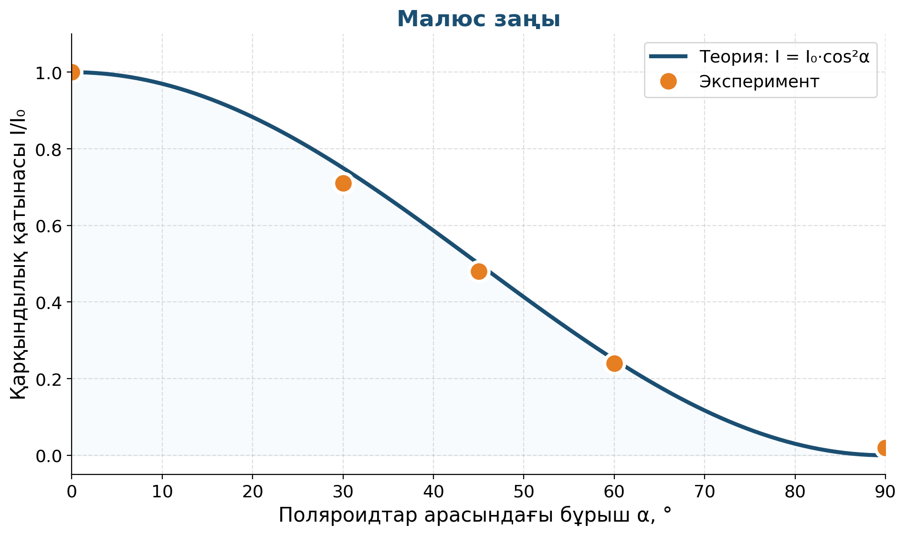

# 13. «Көзімізді соқыр шамдардан қорғайық»

## Жоба паспорты

| | |
|---|---|
| **Сыныбы** | 11-сынып |
| **Бөлім** | Жарықтың поляризациясы |
| **Уақыты** | 1 сабақ |
| **Жоба түрі** | Зерттеушілік |

## Мақсаты

Поляризациялық светофильтр қалай жұмыс істейтінін зерттеу, поляроидтар арасындағы интенсивтілік заңын тексеру (Малюс заңы).

## Зерттеу гипотезасы

> Поляроидтар арасындағы бұрыштан жарық қарқындылығы Малюс заңы бойынша өзгереді: I = I₀·cos²α.

## Зерттеу сұрақтары

1. Бұрыш 90°-қа жеткенде неге толық қараңғы болады?
2. cos²α тәжірибеден дәлме-дәл шыға ма?
3. Күн көзілдіріктері қалай жұмыс істейді?

## Қалыптасатын зерттеу дағдылары

- Поляризация ұғымы
- Малюс заңын тексеру (I = I₀·cos²α)
- Бұрышты дәл өлшеу
- Жарықтың толқындық табиғаты

## Қажетті жабдықтар

- 2 поляроид
- Жарық көзі
- Транспортир
- Люксметр немесе телефон қосымшасы

## Алдын ала қажет білім

- Жарықтың толқындық табиғаты
- Поляризация ұғымы
- Тригонометриялық функциялар

## Жобаның кезеңдері

1. Мотивация. «Көзілдірікпен компьютер экранына қарасаңыз — экран қарайып кетеді. Неге?»
2. Жоспарлау. 2 поляроидтың арасындағы бұрыш α-ны өзгертіп интенсивтілікті өлшеу.
3. Эксперимент. α = 0°, 30°, 45°, 60°, 90° → I өлшеу.
4. Талдау. I/I₀ ≈ cos²α екенін графикалық тексеру.
5. Презентация. Күн көзілдіріктердің қалай жұмыс істейтіні.

## Күтілетін нәтиже

Оқушы Малюс заңын тәжірибеде дәлелдейді, поляризацияланған жарықтың тұрмыстық қолданысын біледі.

## Бағалау критерийлері

Деректер (5), есептеу (5), график (5), презентация (5).

## Пәнаралық байланыс

Информатика (LCD-экран технологиясы), фотоөнер (поляризациялық сүзгіштер), биология (бал арасы поляризацияны қалай көреді).

## Рефлексия сұрақтары (сабақ соңында)

1. Көзілдірік пен телефон экраны арасында неге кейде қара дақ пайда болады?
2. Қандай тұрмыстық жабдықтарда поляризация қолданылады?

## Үй тапсырмасы / жобаның жалғасы

Үйде күн көзілдірігін айналдыра отырып, экранға қарап, қарқындылықтың өзгеруін фото түсіру.

## Мұғалімге практикалық кеңес

> 💡 Жарық көзі ретінде LED-шамды қолданған дұрыс — оның сәулесі біркелкі. Күн сәулесімен жұмыс істегенде уақытқа байланысты қарқындылық өзгеріп, эксперимент дәлдігіне әсер етеді.

## ⚠️ Қауіпсіздік ережелері

Жарық көзіне көзбен ұзақ қарамау.

---

