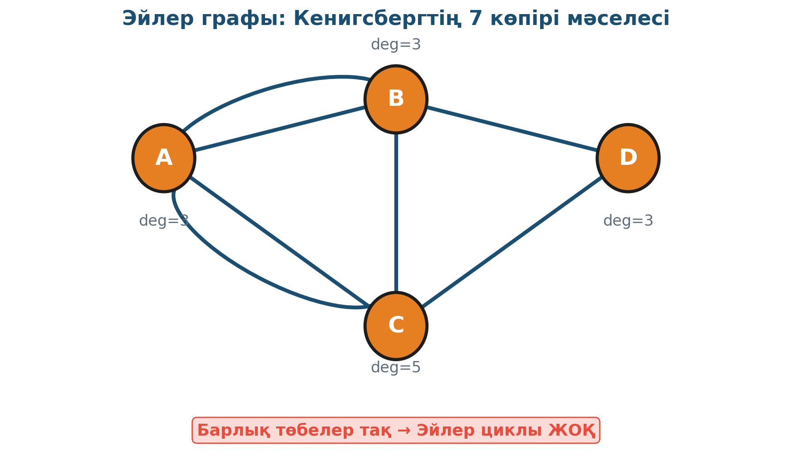

# 14. «Графтар теориясы — Кенигсбергтің жеті көпірі»

## Жоба паспорты

| | |
|---|---|
| **Сыныбы** | 9-сынып |
| **Бөлім** | Пәнаралық (физика-математика-информатика) |
| **Уақыты** | 1 сабақ |
| **Жоба түрі** | Шығармашылық |

## Мақсаты

Эйлер графтары теориясы арқылы қалалық көше желілерін модельдеу және оңтайлы маршрут табу.

## Зерттеу гипотезасы

> Граф төбелерінің барлығы тақ дәрежелі болса, Эйлер циклы (барлық ребро арқылы 1 рет өту) мүмкін емес.

## Зерттеу сұрақтары

1. Кенигсбергтің 7 көпірі арқылы өту маршруты бар ма?
2. Эйлер циклының шарттары қандай?
3. Біздің мектеп ауласын графқа айналдыруға бола ма?

## Қалыптасатын зерттеу дағдылары

- Графиктік модельдеу
- Логикалық ойлау
- Алгоритмдік ойлау
- Командалық пікірталас

## Қажетті жабдықтар

- Карта (қала немесе мектеп ауласы)
- Қарындаш
- Парақ
- Сурет редактор қосымшасы (мүмкіндігінше)

## Алдын ала қажет білім

- Геометриялық фигуралар
- Логикалық тізбек
- Картадан маршрут табу

## Жобаның кезеңдері

1. Мотивация. Кенигсберг қаласының тарихын айту.
2. Жоспарлау. Граф құру тәсілі.
3. Эксперимент. Жергілікті көше желісін графқа айналдыру.
4. Талдау. Эйлер шарты: барлық төбенің дәрежесі жұп.
5. Презентация. «Біздің мектептегі ең қысқа маршрут» жобасы.

## Күтілетін нәтиже

Оқушы графтар теориясының тұрмыстық қолданысын біледі, оңтайлы маршрут есептерін шеше алады.

## Бағалау критерийлері

Граф құру (5), есептеу (5), логика (5), презентация (5).

## Пәнаралық байланыс

Информатика (Дейкстра алгоритмі, ең қысқа жол), математика (комбинаторика), география (логистика).

## Рефлексия сұрақтары (сабақ соңында)

1. Жобалық тапсырмадан мен қандай математикалық идеяларды үйрендім?
2. Графтар қазіргі IT-та қалай қолданылады?

## Үй тапсырмасы / жобаның жалғасы

Өз ауылыңыздың/ауданыңыздың 5 негізгі көшесін графқа айналдырып, барлық көше арқылы өтудің оңтайлы маршрутын іздеу. Эйлер шарты орындала ма?

## Мұғалімге практикалық кеңес

> 💡 Информатика мұғалімімен бірлесіп өткізген дұрыс — пәнаралық сабақ ретінде. Қарапайым GraphOnline.ru сайтында оқушылар өз графын құра алады.

---

