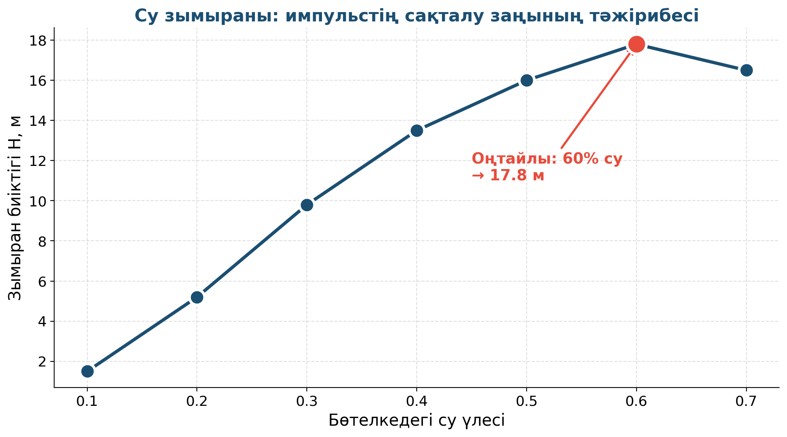

# 15. «Сақталу заңдары — зымыранды құрастыру»

## Жоба паспорты

| | |
|---|---|
| **Сыныбы** | 9-сынып |
| **Бөлім** | Импульстің сақталу заңы |
| **Уақыты** | Апталық жоба |
| **Жоба түрі** | Шығармашылық |

## Мақсаты

Бөтелкеден жасалған су зымыраны арқылы импульстің сақталу заңын тәжірибе жүзінде дәлелдеу.

## Зерттеу гипотезасы

> Импульстің сақталу заңы бойынша зымыранға енгізілген судың массасы мен жылдамдығы зымыранның биіктігін анықтайды.

## Зерттеу сұрақтары

1. Қандай су үлесінде ең биік ұшу мүмкін?
2. Қысым артса биіктік қалай өзгереді?
3. Шынайы зымырандар осы заңмен жұмыс істей ме?

## Қалыптасатын зерттеу дағдылары

- Импульстің сақталу заңы
- Реактивті қозғалыс
- Инженерлік шешім
- Қауіпсіз тестілеу

## Қажетті жабдықтар

- Пластикалық бөтелке (1.5 л)
- Велосипед насосы
- Картон қанаттары
- Желім
- Су

## Алдын ала қажет білім

- Импульс ұғымы (p = m·v)
- Импульстің сақталу заңы
- Реактивті қозғалыс

## Жобаның кезеңдері

1. Мотивация. «Зымыран ауырлықсыз ғарышта қалай қозғалады?»
2. Жоспарлау. Зымыранды құрастыру → 1/3-тей су → ауа қысымы.
3. Эксперимент. 5 ұшыру → биіктікті өлшеу.
4. Талдау. m₁v₁ = m₂v₂ (зымыран мен судың импульстері).
5. Презентация. Биіктік пен бастапқы судың массасы байланысы.

## Күтілетін нәтиже

Оқушы импульстің сақталу заңын реактивті қозғалысқа қолданады, инженерлік цикл арқылы өтеді.

## Бағалау критерийлері

Конструкция (5), эксперимент (5), теория (5), презентация (5).

## Пәнаралық байланыс

Технология (зымыран техникасы, ғарыш), химия (газдардың қысымы), мектеп тарихы (Циолковский, Қорольов).

## Рефлексия сұрақтары (сабақ соңында)

1. Бөтелкеде қандай қатынаста су болғаны жақсы?
2. Үлкен зымырандар қалай ұшады?

## Үй тапсырмасы / жобаның жалғасы

Қалған зымыранды қайта жасап, әр оқушы өз нұсқасын дайындап, мектеп ауласында жарыс ұйымдастыру (классикалық су зымыран фестивалі).

## Мұғалімге практикалық кеңес

> 💡 Бөтелкедегі қысымды 4–5 атмосферадан асырмау керек. Жай велосипед насосы шамамен 6 атмосфераға дейін шығара алады — нормада. Оқушыларды зымыранның алдына ешқашан өткізбеу!

## ⚠️ Қауіпсіздік ережелері

Тек ашық далада ұшыру. Бөтелкенің бағытын адамдарға бағыттамау. Көзілдірік кию.

---

