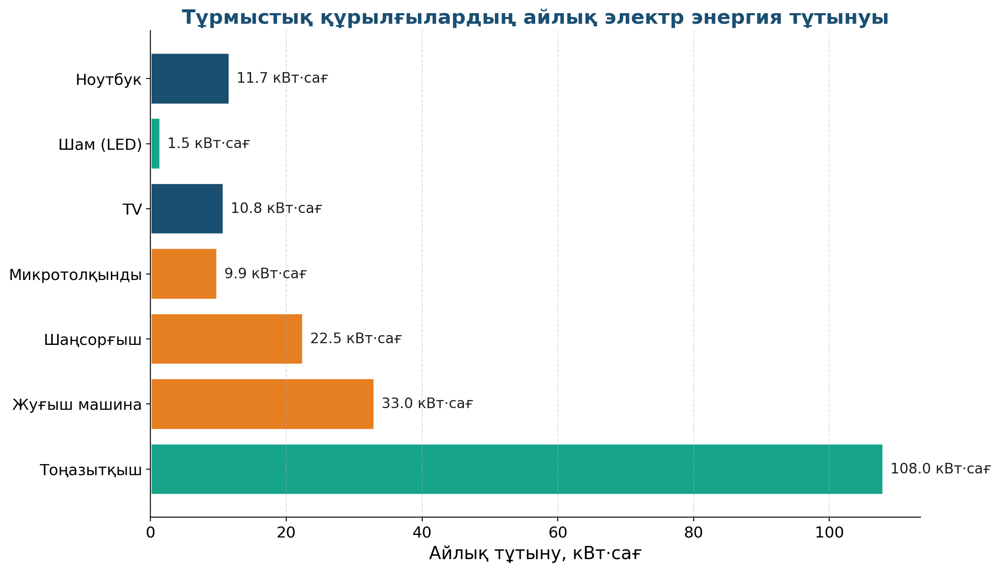

# 16. «Менің үйімдегі электр энергиясы»

## Жоба паспорты

| | |
|---|---|
| **Сыныбы** | 8-сынып |
| **Бөлім** | Электр. Қуат пен жұмыс |
| **Уақыты** | Апталық жоба |
| **Жоба түрі** | Зерттеушілік |

## Мақсаты

Үйдегі тұрмыстық құрылғылардың қуаттарын анықтап, бір айдағы тұтынылған электр энергиясын есептеу (ҚҚҚ — қуат, кернеу, ток).

## Зерттеу гипотезасы

> Үйдегі әрбір құрылғы белгілі бір қуат тұтынады, ал айлық шығын Е = ΣP·t формуласымен есептеледі.

## Зерттеу сұрақтары

1. Қандай құрылғы ең көп энергия тұтынады?
2. Айлық чек қалай қалыптасады?
3. Қалай үнемдеуге болады?

## Қалыптасатын зерттеу дағдылары

- P = U·I формуласын қолдану
- Энергия — Е = P·t есебі
- Кесте мен графикпен жұмыс
- Тұрмыстық экономикалық есеп

## Қажетті жабдықтар

- Үйдегі құрылғылар тізімі
- Қуат көрсеткіштері (паспортта)
- Калькулятор
- Кесте бланкісі

## Алдын ала қажет білім

- Қуат P = U·I
- Энергия Е = P·t (Дж және кВт·сағ)
- Тариф ұғымы

## Жобаның кезеңдері

1. Мотивация. «Айлық электр чегі неліктен 8000 теңге?»
2. Жоспарлау. 10 тұрмыстық құрылғы → P, t/тәул анықтау.
3. Эксперимент (1 апта). Тұтыну күнделігін жүргізу.
4. Талдау. Е = ΣP·t. Тариф бойынша құн.
5. Презентация. Үнемдеу ұсыныстары.

## Күтілетін нәтиже

Оқушы үйдегі энергия тұтыну құрылымын біледі, үнемдеу жолдарын дәлелдеп көрсете алады.

## Бағалау критерийлері

Кесте (5), есептеу (5), қорытынды (5), үнемдеу ұсыныстары (5).

## Пәнаралық байланыс

Экономика (отбасы бюджеті), экология (CO₂ эмиссиясы, жасыл энергия), азаматтық тұжырымдама.

## Рефлексия сұрақтары (сабақ соңында)

1. Үйдегі ең көп тұтынатын құрылғы қандай? Оны қалай ауыстыруға болады?
2. 1 жылда қанша энергия үнемделуі мүмкін?

## Үй тапсырмасы / жобаның жалғасы

Бір апта бойы үйдегі электр санағышының көрсеткішін күн сайын белгілеу. Графикке салғанда қандай заңдылық байқалады?

## Мұғалімге практикалық кеңес

> 💡 Тарифті өзектендіру қажет — әр аймақ бойынша 25–32 ₸/кВт·сағ аралығында. Оқушыларды нақты есеп шотты әкелуге шақырған дұрыс.

---

