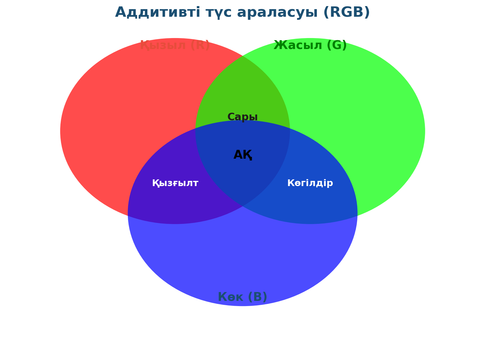

# 17. «Адамның түстерді қабылдауы»

## Жоба паспорты

| | |
|---|---|
| **Сыныбы** | 11-сынып |
| **Бөлім** | Көру және түс |
| **Уақыты** | 1 сабақ |
| **Жоба түрі** | Зерттеушілік |

## Мақсаты

Адам көзінің RGB-сезімталдығын зерттеп, қосымша түстер мен бастапқы түстердің араласу заңдылығын тексеру.

## Зерттеу гипотезасы

> Адамның көзінің торшасында 3 типтегі түс рецепторы (R, G, B); олардың комбинациясы — барлық көретін түс.

## Зерттеу сұрақтары

1. Қызыл + жасыл = қандай түс?
2. Барлық 3 түсті қосса не шығады?
3. Принтер CMYK-пен жұмыс істейді — неге басқа?

## Қалыптасатын зерттеу дағдылары

- Жарықтың аддитивті араласуы
- Көздің рецепторлық жүйесі
- Эксперименттік дәлелдеу
- Биология-физика байланысы

## Қажетті жабдықтар

- 3 түрлі-түсті LED (R, G, B)
- Реостат
- Ақ парақ
- Батарея

## Алдын ала қажет білім

- Жарықтың дисперсиясы
- Толқын ұзындығы мен түс
- Биологиядан көру жүйесі

## Жобаның кезеңдері

1. Мотивация. Слайдта RGB шеңбер.
2. Жоспарлау. 3 LED-ті бір нүктеге бағыттау.
3. Эксперимент. Қызыл+жасыл = сары, қызыл+көк = қызғылт, барлығы = ақ.
4. Талдау. Аддитивті араласу. Принтердегі CMYK-мен салыстыру.
5. Презентация. Көз неге үш түрлі рецептормен жұмыс істейді.

## Күтілетін нәтиже

Оқушы аддитивті түс араласу принципін біледі, теледидар экраны мен баспа техникасының айырмашылығын түсінеді.

## Бағалау критерийлері

Эксперимент (5), теория (5), биологиямен байланыс (5), презентация (5).

## Пәнаралық байланыс

Биология (көздің құрылысы), өнер (түсті палитралар), информатика (RGB форматы, дисплей технологиялары).

## Рефлексия сұрақтары (сабақ соңында)

1. Дальтонизм деген не? Қалай дамиды?
2. Аддитивті/субтрактивті араласудың айырмашылығы неде?

## Үй тапсырмасы / жобаның жалғасы

Үйдегі телевизор экранын лупа арқылы қарап, бір нүктенің үш RGB кіші элементтен тұратынын фотосуретпен дәлелдеу.

## Мұғалімге практикалық кеңес

> 💡 Параллельді LED-тер бір нүктеге жинақталуы үшін ақ парақты алыста (1–1,5 м) қою — әйтпесе түстер араласпай қалуы мүмкін.

## ⚠️ Қауіпсіздік ережелері

LED-ке тікелей қарамау.

---

