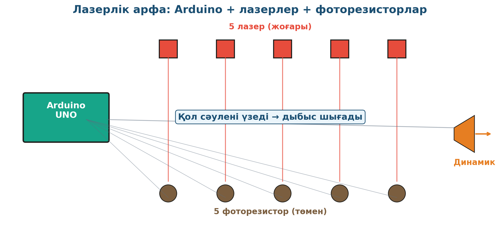

# 18. «Лазерді зерттеу — лазерлік арфа»

## Жоба паспорты

| | |
|---|---|
| **Сыныбы** | 11-сынып |
| **Бөлім** | Лазер физикасы |
| **Уақыты** | Айлық жоба |
| **Жоба түрі** | Шығармашылық |

## Мақсаты

Лазер сәулесі мен фоторезистор арқылы дыбыс шығаратын «лазерлік арфа» аспабын құрастыру (Arduino негізінде).

## Зерттеу гипотезасы

> Жарық сенсорлы фоторезистор сигналын микроконтроллер дыбыстық кодқа аударады.

## Зерттеу сұрақтары

1. Фоторезистордың сезімталдығы қандай?
2. Бір ноттың жиілігі қандай (Hz)?
3. Қалай аккорд жасауға болады?

## Қалыптасатын зерттеу дағдылары

- Arduino-мен жұмыс
- Сенсорларды бағдарламалау
- Жарық пен дыбыс түрлендірудің принципі
- Шығармашылық инженерия
- Командалық жоба

## Қажетті жабдықтар

- Arduino UNO
- 5–7 жасыл лазер
- 5–7 фоторезистор
- Динамик (Buzzer)
- Сымдар, breadboard

## Алдын ала қажет білім

- Лазер мен фоторезистор қасиеттері
- Arduino программалау негіздері
- Дыбыс жиілігі мен ноталар

## Жобаның кезеңдері

1. Мотивация. YouTube-те лазерлік арфа видеосын көрсету.
2. Жоспарлау. Сұлба құру → код жазу.
3. Эксперимент. Әр лазерді өз фоторезисторымен қосу. Қол кескенде тон шығу.
4. Талдау. Жарық сигналының Arduino-ға кіру → дыбыс шығу.
5. Презентация. Концерт 30 секунд.

## Күтілетін нәтиже

Оқушы Arduino платформасында лазер мен сенсорлардың интеграциясын меңгереді, шығармашылық инженерлік жобаны іске асырады.

## Бағалау критерийлері

Қондырғы (10), бағдарлама (5), презентация (5).

## Пәнаралық байланыс

Информатика (программалау, цикл), музыка (нота, аккорд), инженерия (схема, монтаж).

## Рефлексия сұрақтары (сабақ соңында)

1. Қазіргі заманғы цифрлық музыкалық аспаптар қалай жұмыс істейді?
2. Жоба нені үйретті — программалау ма, физика ма, әлде шығармашылық па?

## Үй тапсырмасы / жобаның жалғасы

Жасалған арфамен 30 секундтық музыкалық туынды ұйымдастырып, видеоға түсіру. Сыныпта концерт-рұқсаттама ұйымдастыру.

## Мұғалімге практикалық кеңес

> 💡 Лазерлерді бекіту үшін штатив немесе картон қорапты пайдаланған абзал. Сегізаспалы алюминий профиль — кәсіби көрінеді. Барлығына лазерлік көзілдірік міндетті!

## Цифрлық қолдау

Tinkercad Circuits арқылы Arduino кодын алдын ала тестілеуге болады — нақты лазерлерді бұзу қаупі азаяды.

## ⚠️ Қауіпсіздік ережелері

Лазерді көзге бағыттамау! Көзілдірік міндетті.

---

